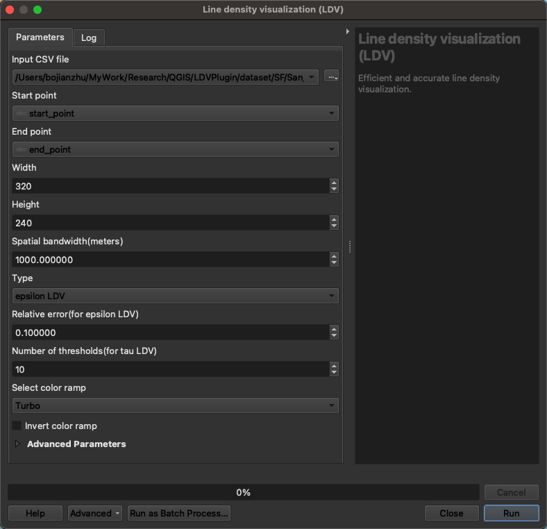
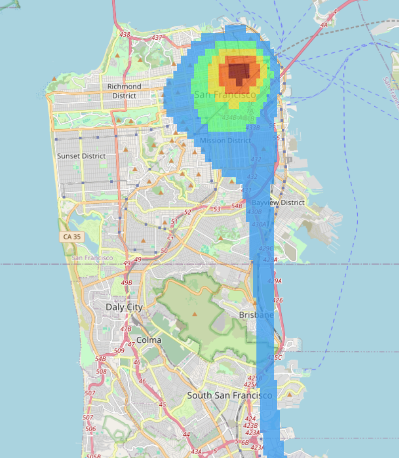

# Fast Line Density Analysis

A Powerful QGIS plug-in for Large-scale Geospatial Analytics

This plugin is built based on an efficient solution, called LARGE, for generating line density visualization (LDV) with non-trivial accuracy guarantees under a single machine setting. Our preliminary experiment results show that this solution can achieve up to 291.8x speedups over the state-of-the-art solutions. One research article that is based on this solution is submitted to a prestigious conference in computer science. More details (e.g., technical parts and implementation details) will be released after this article is accepted.

## Line Density Visualization(LDV)

Efficient and accurate line density visualization.

### **Plugin Interface**



#### Note:

The Input CSV file required for the our plug-in should contain at least two columns:

- **Start Point**: This column should contain the coordinates of the starting point for each data entry.
- **End Point**: This column should contain the coordinates of the ending point for each data entry.

##### **Column Format**

- **Start Point**: POINT(longitude latitude)
- **End Point**: POINT(longitude latitude)

##### CSV File Example

```
Start Point, End Point
POINT(-122.41786 37.75775), POINT(-122.41942 37.77493)
POINT(-122.40311 37.77728), POINT(-122.39167 37.78171)
......
POINT(-122.41386 37.72655), POINT(-122.41542 37.73463)
POINT(-122.40612 37.73278), POINT(-122.40127 37.71141)
```

Each row in the CSV file represents a connection between a start point and an end point, with the coordinates specified in the WKT (Well-Known Text) format `POINT(longitude latitude)`.

### **Important parameters:**

1. **Width** 
   The width in pixels for the output visualization.
2. **Height** 
   The height in pixels for the output visualization.
3. **Spatial bandwidth (meters)** 
   The influence radius (in meters) used for line density calculations.
4. **Type** 
   The method used for the LDV. Possible options include:
   - **epsilon LDV (𝜖LDV)**: generating LDV with an 𝜖-relative error guarantee.
   - **tau LDV (𝜏LDV)**: generating LDV with multiple thresholds.
5. **Relative error** 
   The 𝜖-relative error guarantee for 𝜖LDV.
6. **Number of thresholds** 
   The number of discrete thresholds for 𝜏LDV.

### **Result Demo**

**𝜖LDV:**


**𝜏LDV:**


